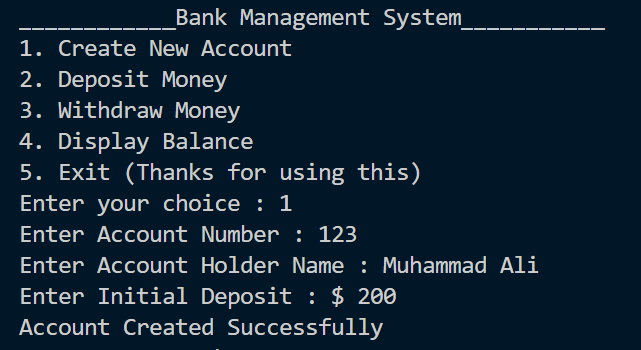

# 🏦 Bank Management System (C++)

A console-based banking application simulating core financial operations with secure transaction processing and account management.

 <!-- Add your screenshot here -->

##  Features

- **Account Management**
  - Create new accounts (100 accounts capacity)
  - View account details and balances
- **Transaction Processing**
  - Secure deposit/withdrawal operations
  - Overdraft protection
- **User Experience**
  - Intuitive console menu
  - Input validation and error handling
    
> Developed by Me as Programing Fundamentals Project 

🔗 Connect with me on [LinkedIn](www.linkedin.com/in/alibro005)
